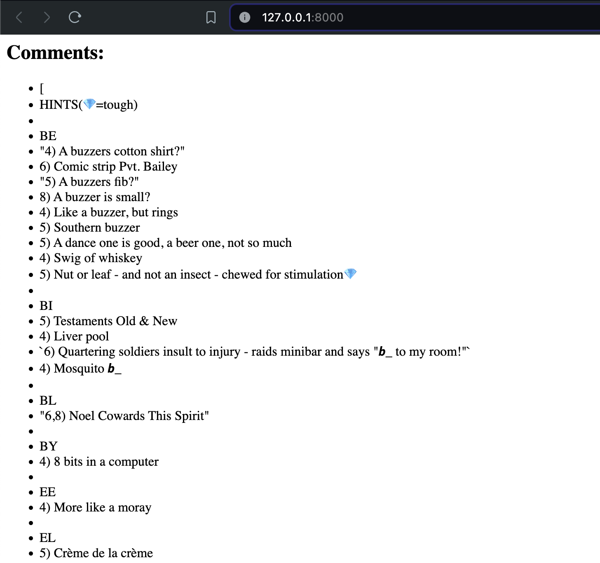

# Charlie's CSDS 285 Portfolio

### Scripts for Java TAs
This semester, I was a TA for CSDS 132, so I came up with a few simple aliases to help with grading projects.

#### Bulk compile/delete
```zsh
alias compile="ls | grep '.*.java' > sources.txt; javac @sources.txt"
alias clean="rm *.class; rm *.java"
```
TLDR:
- Compile and delete CSDS 132 project files very quickly

The first two 132 projects don't have a lot of files, so I was fine with compiling and deleting these by hand after grading.  The third project, however, had on average 10 files to compile and sift through, so I wrote these aliases to compile all of the project files at once and to delete all of them at once.  This made it very easy to verify that programs could actually run, and it probably **saved me at least 20 min per grading session**.


#### Switch Java version
```zsh
alias j21="export JAVA_HOME=`/usr/libexec/java_home -v 21`; java -version"
alias j17="export JAVA_HOME=`/usr/libexec/java_home -v 17`; java -version"
alias j8="export JAVA_HOME=`/usr/libexec/java_home -v 1.8`; java -version"
```
TLDR:
- Switch Java versions for different classes

In addition to TA'ing, I was also taking CSDS 293, which required a different version of Java than 132.  This meant that I was constantly having to switch between Java versions for class work and TA work.  These aliases made switching between versions way faster.


---

### Scrape New York Times Spelling Bee Comments
I am an avid fan of the NYT Spelling Bee game, which involves making as many words as possible from a set of 7 words.  There are other even more devoted Spelling Bee fanatics, and they like to write comments as clues to the words in the community tab.

TLDR:
- This script scrapes Spelling Bee comments to retrieve clues

#### Version 1
Initially, I was not aware of any way to make php process a dynamic webpage, so I couldn't actually get the comments since a side panel needed to be opened to generate the comments.  Instead, I had the script just grab the hints grid on the static webpage.

##### scraper.php
```php
error_reporting(0);

$url = "https://www.nytimes.com/2024/04/25/crosswords/spelling-bee-forum.html";

$doc = new DOMDocument();

$doc->loadHTMLFile($url);

$finder = new DOMXPath($doc);

$query = "//*[contains(@class, 'content') or contains(@class, 'table')]";

$hints = $finder->query($query);

echo "<div>";
foreach ($hints as $item) {
    echo $doc->saveHTML($item);
}

echo "</div>";
```


<br/>

#### Version 2
I used ChatGPT to help me come up with a solution to retrieve the contents of the dynamic webpage.  It suggested I use a headless browser, such as Puppeteer for JavaScript.  I had ChatGPT write the script for spinning up the headless browser, and I tweaked the php script to call the .js file.

##### fetch_comments.js
```JavaScript
const puppeteer = require("puppeteer");

(async () => {
  const browser = await puppeteer.launch();
  const page = await browser.newPage();
  await page.goto(
    "https://www.nytimes.com/2024/04/25/crosswords/spelling-bee-forum.html#commentsContainer"
  );

  await page.waitForSelector(".css-199z855");

  const comments = await page.evaluate(() => {
    const commentElements = document.querySelectorAll(
      ".css-199z855 .css-1ep7e7p"
    );
    const comments = [];
    commentElements.forEach((element) => {
      comments.push(element.textContent.trim());
    });
    return comments;
  });

  console.log(comments);

  await browser.close();
})();
```
##### scraper.php
```php
// Command to run JavaScript file
$command = 'node fetch_comments.js';

$output = shell_exec($command);

echo "<h2>Comments:</h2>";
echo "<ul>";
foreach (explode("\n", $output) as $comment) {
    $comment = preg_replace("/\'/i", "", trim($comment, '+'));
    $cleancomment = preg_replace("/\\\\n/i", "", $comment);
    echo "<li>$cleancomment</li>";
}
echo "</ul>";
```

